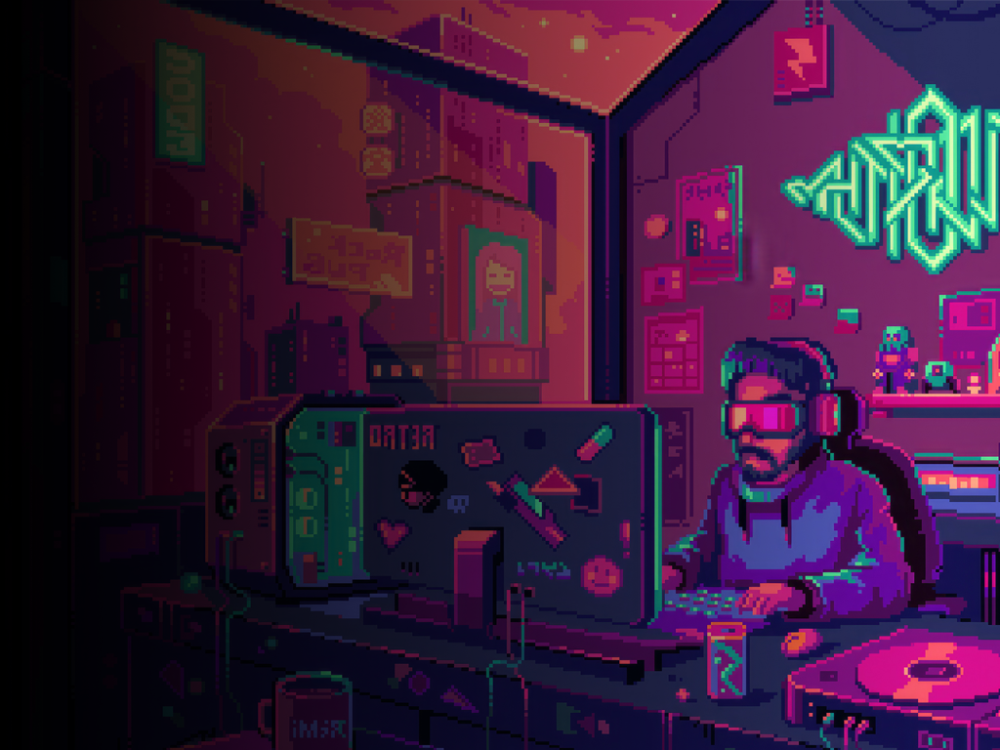
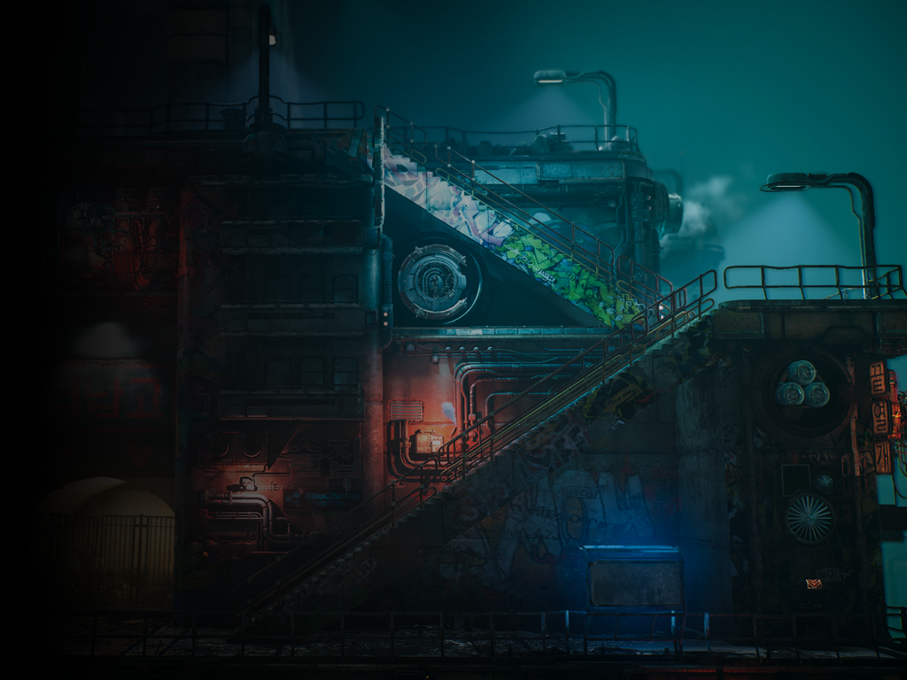
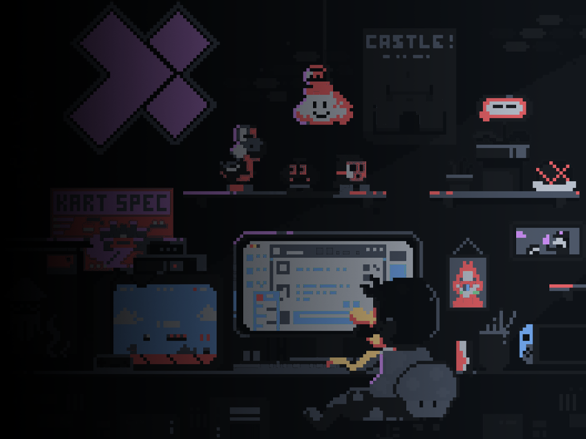

# NextUI Theme Manager

A comprehensive theming solution for your NextUI device that lets you customize virtually every visual aspect of your handheld. No more manual file copying or tedious background swapping!

---

## Features

- **Complete Theme Management**: Import, export, and apply full theme packages that can customize every visual aspect of your device
- **Component-Level Customization**: Apply specific components like wallpapers, icons, accents, LEDs, fonts, and overlays
- **Theme Deconstruction**: Break down complex themes into individual components to mix and match your perfect setup
- **System-Specific Customization**: Apply custom wallpapers and icons for each emulation system
- **Collection Theming**: Customize your collection folders with unique backgrounds and icons
- **Export Your Setup**: Save your current configuration as a shareable theme package

## Components You Can Customize

- **Wallpapers**: Change background images for the main menu, systems, tools, collections, and recently played
- **Icons**: Customize icons for all systems, tools, and collection folders
- **Accent Colors**: Modify the UI color scheme of your device
- **LEDs**: Configure custom lighting patterns and colors (TrimUI Brick only)
- **Fonts**: Replace system fonts with custom alternatives
- **Overlays**: Apply system-specific overlay images

## Installation

1. Download the latest `Theme-Manager.pak` from the releases page
2. Copy it to your device's `Tools/tg5040` directory
3. Launch it from the Tools menu on your device

## Getting Started

### Browsing Themes
1. Launch Theme Manager from the Tools menu
2. Select "Browse Themes" from the main menu
3. Choose a theme from the gallery view (currently ships with 2 themes)
4. Confirm to apply the selected theme

### Managing Components
1. Select "Components" from the main menu
2. Choose the component type (Wallpapers, Icons, etc.)
3. Browse, import, or export components as needed

### Exporting Your Setup
1. Select "Export" from the main menu
2. The current configuration will be saved as a theme package in the `Exports` directory

## Theme Structure

Themes are stored as directories with the `.theme` extension and contain all the necessary files to transform your device's appearance. See the [Theme Format Documentation](documents/THEMES.md) for details on the structure.

## Component Packages

For more granular control, the Theme Manager supports individual component packages that focus on specific aspects of customization. See the [Component Documentation](documents/COMPONENTS.md) for more information.

## Creating Custom Themes

Want to build your own theme from scratch? Check out our [Theme Creation Guide](documents/THEME_BUILDING.md) for a step-by-step walkthrough.

## Compatibility

Currently optimized for:
- TrimUI Brick

## Known Issues

- Some system icons might require exact naming to work properly
- Certain custom fonts may cause text rendering issues
- Preview images MUST BE named `preview.png`, more information available in the 

## Credits

- Special thanks to the NextUI community for testing and feedback
- Original concept and development by @Leviathan
- @frysee for literally everything
- @kytz for the work on Noir-Minimal
- @GreenKraken22 for finding and suggesting arcade-dark
- @Fujykky for the work on Screens-Thematic
- Everyone else in the NextUI discord
- Epic Noir theme from https://github.com/c64-dev/es-theme-epicnoir
- All artwork and image source rights go to their respective owners.
