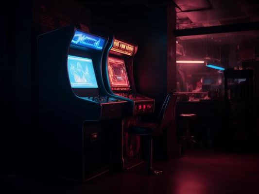

# NextUI Themes

This repository contains a collection of themes for NextUI, designed for the TrimUI Brick. These themes are a work in progress, and many are suggestions or contributions from the official NextUI Discord server. 

---
## Gallery

---
## Guide
In the menu, there are several options:

_Theme Management_
- **Simple Themes:** These are individual images that will be pasted across _all_ relevant areas that backgrounds can be loaded in NextUI. This option pastes a `bg.png` inside the `.media` folder, as well as a few other places like `root` for example.
- **Dynamic Themes (still work in progress):** These are going to be curated themes created by the community that will change individual system backgrounds, LEDs, accent colors, AND fonts all at once. Right now it's only partially working.
- **Default Theme:** This offers the ability to either _remove or replace with black_ ALL `bg.png` files across NextUI if you want to start over fresh.

---

_Customization_
- **System Backgrounds:** This allows you to choose individual locations where you want to place a specific background. This includes `root`, `Recently Played`, `Tools`, and ALL directories with a system tag detected in `Roms`.
- **Fonts:** Yes, you can change fonts now! For now we're just testing with a couple demo examples, but here is where you would change fonts.
- **Accent Colors (still work in progress):** Accent colors can be changed here. If you run into any weird issues you can fix the accent colors in `Settings.pak` or you can use the `Classic White` option to reset to default.
- **LED Quick Settings (still work in progress):** This offers quick access to changing the LED controls. This is NOT MEANT to be a REPLACEMENT for `LEDControls.pak`, rather a quick way to tweak them, since the goal is that the **Dynamic Themes** will eventually be able to take advantage of them. That way you can revert or change them quickly if you don't like something.

---

### NOTE: Icons have not been added or tested yet, but they will be coming soon!

---

## Installation

1. Clone or download the repo.
2. Move the `Theme-Manager.pak` folder into your `Tools/tg5040` directory on your SD card.
3. Launch it on your Brick and change your theme!

## Sources

- @frysee for literally everything
- @kytz for the work on Noir-Minimal
- @GreenKraken22 for finding and suggesting arcade-dark
- @Fujykky for the work on Screens-Thematic

- Epic Noir theme from https://github.com/c64-dev/es-theme-epicnoir
- All artwork and image source rights go to their respective owners.
