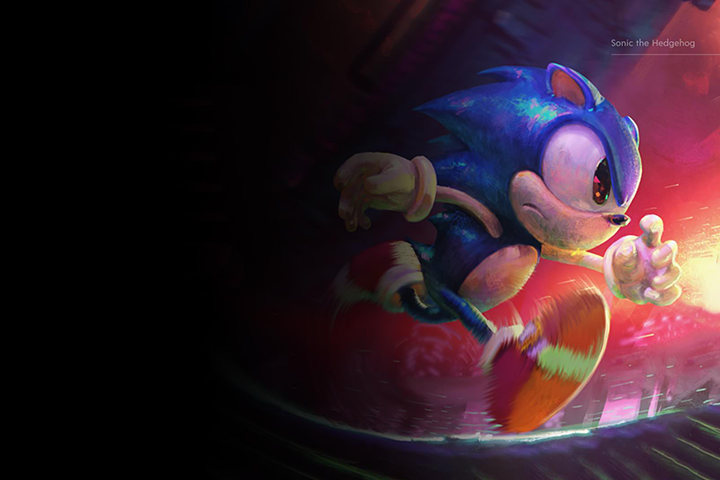
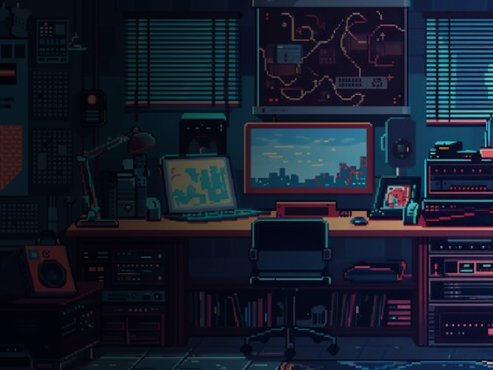
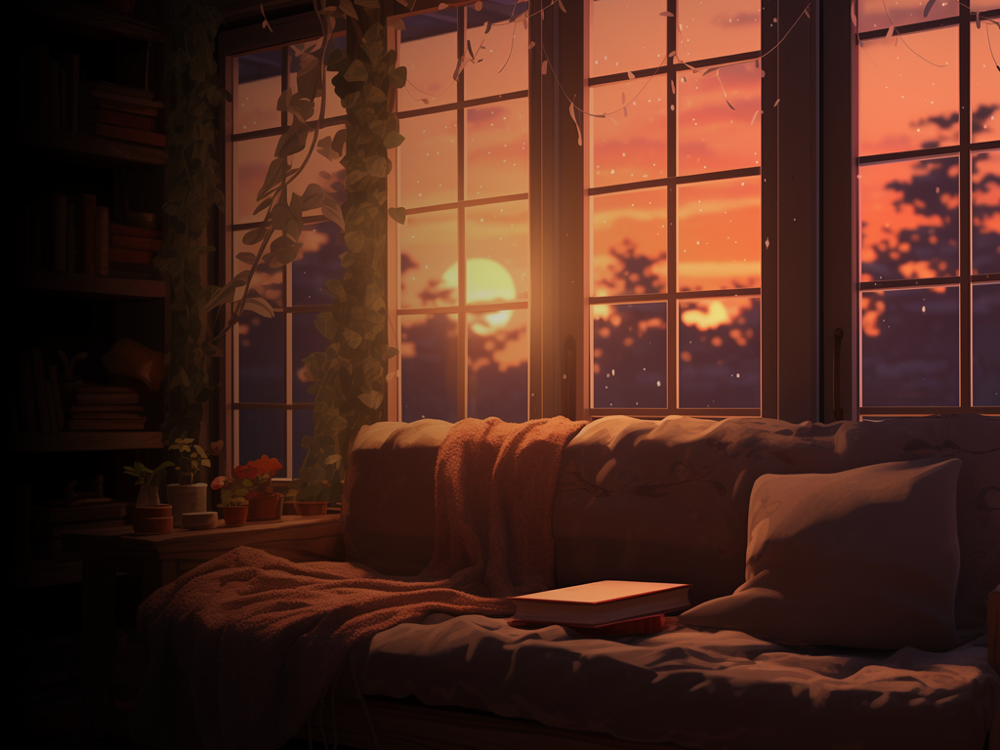
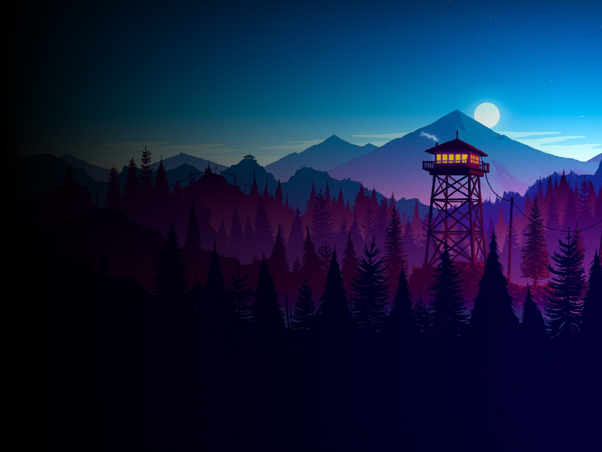

# NextUI Themes

This repository contains a collection of themes for NextUI, designed for the TrimUI Brick. These themes are a work in progress, and many are suggestions or contributions from the official NextUI Discord server. 

These themes come with no icons of any kind, so you will have to manually scrape your boxart yourself using Skraper or Artwork Manager.pak. These are just a collection of curated wallpapers for now.

It is also important to note that currently, for dynamic themes, NOT ALL SYSTEMS HAVE ARTWORK YET. Only curated artwork is available for certain systems. 

## Gallery

## Installation

The installation steps may change as NextUI develops. Here's how it should work currently:

1. Choose a theme from `themes/dynamic` or `themes/static`.
2. For dynamic themes, take `bg.png`, `Recently Played`, `Roms`, and `Tools` and MERGE them onto the root of your SD card.
3. For static themes, take `bg.png`, `Recently Played`, and `Tools` and MERGE them onto the root of your SD card.
4. NOTE: The only files that should be written/overwritten during the merge should be `bg.png` in each subdirectory. Be careful when pasting into the SD card root not to accidentally overwrite full, existing directories that have files in them.
5. If you are a Mac user, you can use the Option key to click and drag the files over, this should give you the option to "Merge" if you are not fullscreened in the Finder.

## Sources

- @kytz for the work on Noir-Minimal
- @GreenKraken22 for finding and suggesting arcade-dark
- @Fujykky for the work on Screens-Thematic

- Epic Noir theme from https://github.com/c64-dev/es-theme-epicnoir
- All artwork and image source rights go to their respective owners.
